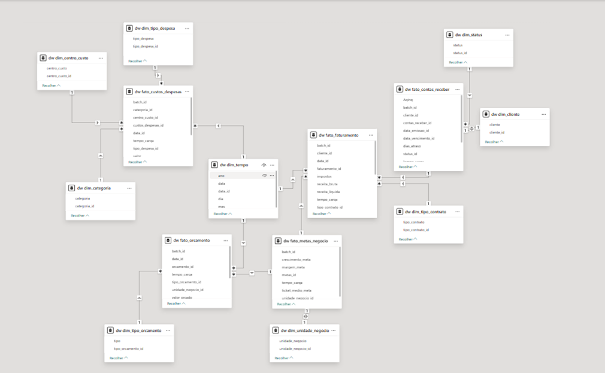

# Gestão Financeira

Projeto completo de engenharia e análise de dados desenvolvido para acompanhamento da performance financeira, controle de custos, análise de rentabilidade e suporte a tomada de decisão.

O projeto foi feito utilizando arquitetura moderna de Data Warehouse, automação ETL em Python, PostgreSQL e dashboards analíticos com Power BI.

---

## Objetivos do Projeto

Este projeto foi desenvolvido com foco em:

- Centralização dos dados financeiros
- Automatização de processos ETL
- Monitoramento da saúde financeira
- Análise temporal de indicadores
- Controle de custos e despesas
- Comparação Realizado x Orçado
- Suporte a tomada de decisão
- Estrutura escalável para ambiente produtivo

---

## Tecnologias Utilizadas
- Python
- PostgreSQL
- Power BI
- SQLAlchemy
- Pandas
- DAX
- Power Query
  
# Arquitetura da Solução

```text
Arquivos Excel / CSV
        ↓
Python ETL
        ↓
  PostgreSQL (Staging + Data Warehouse)
        ↓
Views SQL Otimizadas
        ↓
Power BI
```
---

# Pipeline ETL

Todo o processo de ETL foi feito com Python, utilizando estrutura modular e arquitetura preparada para ambiente produtivo.

## Extração

- Leitura automática de múltiplas abas Excel
- Estrutura dinâmica de DataFrames
- Suporte para expansão de novas fontes
- Preparado para execução automatizada

## Transformação

- Normalização textual
- Conversão automática de datas
- Tratamento de valores nulos
- Padronização de colunas
- Limpeza de dados

## Carga

- Camada staging
- Inserção automatizada
- Controle de batch
- UPSERT com `ON CONFLICT`
- Rastreabilidade completa

---

# Decisões Técnicas

## Uso de Staging Layer

A camada staging foi implementada para separar os dados brutos do modelo analítico, permitindo maior controle sobre qualidade, rastreabilidade e reprocessamento.

## Controle de Batch

Cada execução gera um batch_id único e timestamp de carga, permitindo auditoria completa e versionamento das cargas.

## UPSERT Automatizado

Foi utilizada estratégia de UPSERT com ON CONFLICT para evitar duplicidade de registros e garantir atualização incremental eficiente.

## Modelagem Snowflake

A modelagem dimensional foi estruturada em esquema Snowflake visando organização, escalabilidade e clareza analítica. 

---

# Modelagem Dimensional

O projeto foi estruturado utilizando modelagem dimensional em esquema Snowflake, com separação entre tabelas fato e dimensão, priorizando escalabilidade, rastreabilidade e performance analítica.

## Principais Componentes

### Tabelas Fato

- fato_faturamento
- fato_custos_despesas
- fato_contas_receber
- fato_orcamento
- fato_metas_negocio

### Tabelas Dimensão

- dim_tempo
- dim_cliente
- dim_status
- dim_categoria
- dim_unidade_negocio
- dim_tipo_contrato
- dim_tipo_despesa
- dim_tipo_orcamento
- dim_centro_custo

---

## Estrutura do Modelo

<p align="center">
  
</p>

---

# Indicadores Estratégicos

## Receita

- Receita Bruta
- Receita Líquida
- Receita MoM
- Receita YoY

## Rentabilidade

- Margem Bruta
- EBITDA
- Margem Líquida

## Operacional

- Ticket Médio
- Inadimplência
- Aderência Orçamentária
- Custos Operacionais
- Receita por Unidade de Negócio

---

# Dashboard Executivo

Painel desenvolvido para acompanhamento estratégico da saúde financeira da operação.

## Principais Recursos

- KPIs estratégicos
- Tendências temporais
- Comparação realizado x orçado
- Insights executivos
- Visão consolidada da operação

---

# Dashboard Operacional

Painel desenvolvido para acompanhamento operacional e analítico da empresa.

## Principais Recursos

- Rentabilidade por cliente
- Análise de despesas
- Inadimplência
- Custos por unidade
- Comparativos históricos
- Identificação de tendências e outliers

---

# Desafios Técnicos Resolvidos

- Modelagem dimensional escalável
- Controle de integridade dos dados
- Tratamento temporal
- Otimização de performance no Power BI
- Estrutura preparada para ambiente produtivo
- Separação staging → DW → BI
- Estrutura de rastreabilidade
- Normalização automatizada
- Gestão de múltiplas fontes de dados

---

# Impacto do Projeto

Com este projeto foi possível:

- Melhorar a visibilidade financeira da operação
- Apoiar tomadas de decisão estratégicas
- Identificar tendências financeiras
- Monitorar KPIs em tempo real
- Estruturar uma base analítica escalável
- Criar uma arquitetura preparada para crescimento

---
